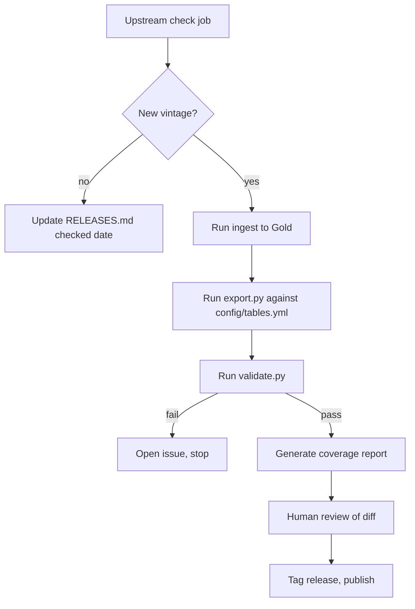

# Patterns in Place: Metro & Micro Panel Release Spec

**Status:** Scoped for Phase 0 · **Last updated:** 2026-09-23 · **Owner:** Dan

## Purpose

Publish a small, well documented, citable slice of the Patterns in Place Gold layer as an open CBSA panel, so that the harmonization work is visible and reusable by other people.

The product is not the underlying data. ACS, BEA, HUD, and Census geography files are publicly available. The product is the harmonization: a current-vintage county-to-CBSA crosswalk and two CBSA-year panels covering all 935 current CBSAs, with the crosswalk decisions, source vintages, and derived metric formulas written down. Framed for an outside reader: this is the join you do not want to do.

### Goals

1. A citable research artifact with a DOI, usable as a portfolio and application credential.
2. A zero friction access path: one DuckDB query, no signup, no download required.
3. Documentation good enough that a stranger can trace any column back to its upstream source variable without asking.
4. A repeatable release process, so v2 costs a day instead of a month.

### Non-goals

- Revenue, licensing or any commercial path.
- Completeness. This is three tables, not the warehouse.
- A hosted API, query UI or dashboard. Those are separate products.
- Real time or high frequency data. Sources are annual or quarterly.

### Success criteria

| Criterion | Target |
| --- | --- |
| Release published with DOI | v2026.1 live on Source Cooperative and Zenodo |
| Quickstart query works from a clean machine | Verified, no local install beyond DuckDB |
| Accompanying analysis published | One post using the released tables, same window |
| External pickup | At least one of: Data Is Plural, NICAR-L reply, third party use |
| Rebuild cost | Full release rebuildable by one command |

## Release contents (v2026.1)

Three tables. One makes county-to-CBSA reconciliation straightforward, one is differentiated, and one is the download driver. This is a deliberately narrow first release: no Zillow, Census BFS/CBP, BLS QCEW, permits, vacancy/occupancy, or HUD CHAS burden measures.

| Table | Role | Source Gold table | Upstream | Why it ships |
| --- | --- | --- | --- | --- |
| `cbsa_county_crosswalk` | Geographic bridge | `silver.xwalk_*` + CBSA membership | Census/OMB current CBSA delineation | One static county-to-CBSA membership table with county/state identity, county role, CBSA type, and primary state. Lets anyone join county data to the panel. |
| `economics_industry_wide` | Differentiated | `gold.economics_industry_wide` | ACS, BEA | ACS employment mix plus BEA real GDP and three GDP-industry shares at CBSA-year grain. Substrate for the first analysis. |
| `affordability_wide` | Download driver | `gold.affordability_wide` | ACS, HUD FMR | Rent-to-income, value-to-income, annualized rent, and FMR gap at CBSA-year grain. |

### Locked v1 boundaries

- **Geography:** all 935 current CBSAs, including metropolitan and micropolitan areas. `cbsa_county_crosswalk` is static, has no year field, and is not a historical membership series.
- **Crosswalk fields:** county and state identifiers/names; CBSA code, name, official type, and short metro/micro type; central/core versus outlying county role; and deterministic primary state. The primary state is the first state suffix in the official CBSA name; full multi-state membership remains visible in the county rows.
- **Industry allowlist:** geographic identifiers; ACS employment total, four broad industry shares, and ACS industry HHI; BEA real GDP total and three broad industry shares. BEA GDP concentration HHI is deferred because its conservative-suppression coverage is too sparse.
- **Affordability allowlist:** geographic identifiers; ACS median gross rent, annualized rent, median home value, median household income, rent-to-income, and value-to-income; HUD two-bedroom FMR and the FMR-to-median-rent gap.
- **Explicit exclusions:** Zillow/ZHVI/ZORI and any Zillow-derived calculation; BEA RPP and metro real-personal-income fields; BEA GDP concentration HHI; BFS; CBP; QCEW; permits; vacancy and occupancy; HUD CHAS burden measures; and all other Gold columns absent from the allowlist.

The Phase 0 lineage audit may correct a proposed field name or remove a field whose lineage cannot be documented, but it may not add an excluded source or field to v1.

### Zillow removal

Zillow is out of the public release entirely. Before build, audit `gold.affordability_wide` for any ZHVI or ZORI derived columns. Confirm that public `value_to_income` is built on ACS median home value (`B25077`); rebuild the public calculation if necessary. Keep any Zillow-based version internal and unreleased. The public build should have no Zillow dependency in its lineage at all, not just no Zillow columns in the output.

### Held back from v1

| Table | Reason |
| --- | --- |
| BFS, CBP, and QCEW extensions | Valuable but add Census/BLS documentation and source-vintage surface. Revisit after the first release receives feedback. |
| HUD CHAS, permits, vacancy, and occupancy extensions | Useful affordability context, but widen the panel and introduce uneven or non-annual coverage. Revisit after v1. |
| `economics_labor_wide` | LAUS unemployment is easy to get from BLS directly. Documentation burden without scarcity. |
| `economics_gdp_wide` | Headline metro GDP is a straightforward BEA pull. Superseded by the industry table for our purposes. |
| `housing_core_wide` | Zillow entanglement plus high column count. Candidate for v2 after the Zillow audit. |
| `population_demographics` | Widely mirrored elsewhere. Adds bulk, not value. |
| `migration_wide`, `transport_built_form_wide` | Thin relative to the ACS originals. Revisit when IRS flows land. |
| Composite and intelligence scores | Not production ready. Publishing unvalidated scores would undercut the credibility the rest of the release is buying. |
| `tx_isd_metrics` | Off the CBSA grain. Different release entirely. |

### Coverage

To confirm during build and state explicitly in the README: year range per table, CBSA count per year, whether the panel is balanced, and coverage/vintage for every public column. The crosswalk remains static at the selected current delineation vintage; fact-table source coverage can differ by column and must be documented rather than hidden.

## Internal release workspace and eventual public repo

A new internal workspace lives in this private monorepo first. It builds directly from the private Gold DuckDB so the first release can ship quickly. Once the export contract is proven, its public-safe code and documentation move to a standalone public repository. The private platform remains private.

The public project title is **Patterns in Place: Metro & Micro Panel**. The public repository and canonical data slug are `pip-metro-micro-panel`. The technical documentation uses “CBSA” where precision matters; public-facing copy leads with “metropolitan and micropolitan areas.”

```markdown
public-cbsa-panel/
├── README.md                  # internal scope, release checklist, and public-repo handoff
├── spec/
│   └── v2026.1_scope.md       # frozen v1 grains, allowlists, exclusions, and acceptance criteria
├── audit/
│   ├── lineage.md
│   └── public_column_lineage.csv
├── config/
│   └── tables.yml             # public table + column allowlist, descriptions, null thresholds
├── build/
│   ├── export.py              # Gold DuckDB -> public Parquet + bundled .duckdb
│   ├── validate.py            # contract checks, fails the build
│   └── coverage_report.py     # generates validation/coverage_report.md
├── templates/                 # public README, methodology, and table-document templates
└── output/                    # gitignored release artifacts
```

### Conventions

- Table and column names in the public release are snake_case and frozen. A rename is a breaking change and gets a major version.
- `config/tables.yml` is the single source of truth for what is public. The exporter never reads a table not listed there. This is the guard that keeps internal columns, including anything Zillow derived, out of the release by construction.
- The two fact tables carry `geo_level`, `geo_id`, `geo_name`, `year` as the leading columns, in that order. The static crosswalk carries its county and CBSA key fields first and has no `year`.
- `manifest.json` records table-level and column-level source vintages. A `source_vintage` output column is used only when a value truly varies by row.
- Parquet files use ZSTD compression and are written as a single file per table, not partitioned. At this row count partitioning adds friction for readers and buys nothing.
- `manifest.json` is machine readable and is what a downstream user or a future refresh job checks against.

## Documentation spec

The data dictionary already exists in `foundations/data_dictionary/layers/gold/`. Most of this is a rendering job, not a writing job. Generate `docs/*.md` from the dictionary YAML where possible so the docs cannot drift from the schema.

### README.md

Order matters. A reader decides in fifteen seconds whether to keep going.

1. One sentence: what this is and what grain it is on.
2. The quickstart query, above the fold, copy and paste ready.
3. Table inventory: three rows, name, what it covers, years, row count.
4. Coverage and caveats in three bullets.
5. License, citation block, DOI badge.
6. Links to `METHODOLOGY.md`, `docs/`, `RELEASES.md`.

Quickstart, verbatim in the README:

```sql
INSTALL httpfs; LOAD httpfs;
SELECT * FROM read_parquet('https://data.source.coop/<publisher>/pip-metro-micro-panel/v2026.1/affordability_wide.parquet') LIMIT 10;
```

### METHODOLOGY.md

This is the document that carries the credibility. Sections:

- **CBSA definition and vintage.** Which current delineation vintage is released, its 935-CBSA universe, and the fact that the crosswalk is static rather than a historical membership series.
- **Crosswalk construction.** How county-to-CBSA membership and central/core versus outlying status are built, how multistate CBSAs receive a deterministic primary state, and what happens to counties with no CBSA.
- **ACS interpretation.** Five year rolling estimates, what `year` means (end year of the window), why overlapping windows mean year over year deltas are not independent observations.
- **Suppression and missingness.** How suppressed or unreliable estimates are represented, and whether margins of error are carried.
- **Derived metric formulas.** Every computed column written out as a formula, not prose.
- **Known issues.** An honest list. This section buys more trust than any other.

### Per table doc template

Identical structure for all three files in `docs/`:

1. **Header.** Table name, one line description, grain, primary key.
2. **Coverage.** Years, geo levels, row count, distinct CBSA count, balanced or unbalanced.
3. **Column table.** The core of the document:

| Column | Type | Definition | Units | Upstream source | Upstream variable | Null behavior |
| --- | --- | --- | --- | --- | --- | --- |

The `Upstream variable` column is the one that separates this from every other scraped panel. A reader should be able to trace `rent_to_income_ratio` back to specific ACS table numbers without asking.

4. **Derived formulas.** For any computed column, the formula in a latex block.
5. **Caveats.** Table specific gotchas.
6. **Example queries.** Two or three, showing the table doing something real.

### Coverage report

`validation/coverage_report.md` is generated by `build/coverage_report.py` and committed with each release. For fact tables it includes row count and distinct CBSA count by year, null rate by column by year, and min/max/median for numeric columns. For the static crosswalk it reports total memberships, distinct counties, distinct CBSAs, and null rates.

This is a small build with outsized payoff. Null rates by year make suppression and coverage gaps visible up front instead of something a user finds three hours in. It is also diffable between releases, which is how you catch an upstream schema change.

### CITATION.cff

Standard CFF, with `type: dataset`, author, title, version, DOI and release date. GitHub renders a citation widget from it and Zenodo reads it on release.

## Hosting, versioning, licensing

Three hosts, three jobs. No single vendor sits between a reader and the data.

| Host | Holds | Why |
| --- | --- | --- |
| [Source Cooperative](https://source.coop) | Canonical Parquet + bundled `.duckdb` | Free for public data, nonprofit (Radiant Earth), HTTP range readable so DuckDB queries remotely with no download. Audience skews research and civic data. |
| GitHub | Docs, build code, release tags, coverage reports | Where the methodology lives and where issues get filed. Docs render via Pages. |
| [Zenodo](https://zenodo.org) | Versioned archive + DOI | Turns a repo into a citable artifact. Hooks to GitHub releases, mints a DOI per version plus a concept DOI for the dataset as a whole. |

MotherDuck is deliberately not in v1. A MotherDuck share requires the consumer to hold a MotherDuck account in the same cloud region and attach the share to their workspace. That is fine as a convenience path for people already on the platform, and wrong as the front door. Revisit as a secondary surface after v1 ships.

### Formats

Publish both, always:

- **Parquet, one file per table.** Powers the zero friction quickstart. This is the format the release is actually judged on.
- **A single bundled `.duckdb` file.** The "just give me the whole thing" path. Includes all three tables plus a `_manifest` table.

### Versioning

- Scheme: `vYYYY.N`, so `v2026.1` is the first release of 2026.
- Releases are immutable. A published version is never overwritten, never patched in place. A mistake gets `v2026.2`, and `CHANGELOG.md` says what was wrong.
- No `latest` alias in the data paths. Readers must cite a version. A moving target is uncitable.
- Schema changes: an added column is a minor release. A removed or renamed column, or a changed definition for an existing column, is a new year band or a documented breaking change called out at the top of the changelog.
- The git tag, the Source Cooperative path, the Zenodo version and `manifest.json` all carry the same version string. The release workflow should fail if they disagree.

### Licensing

- Derived tables: **CC-BY-4.0**. Attribution is the point, given the goals.
- Upstream is entirely federal (ACS, BEA, HUD, Census TIGER), so there is no redistribution constraint to manage once Zillow is out.
- `README.md` carries an explicit upstream attribution block naming each source agency and dataset, separate from the license.
- Build code: MIT, so the pipeline itself is reusable.

## Refresh automation

Refresh is an internal pipeline concern, not a release cadence promise. The public release is versioned and occasional. The automation exists so that producing a version is cheap and so that upstream releases do not sit unnoticed for months.

### Per source cadence

| Source | Upstream cadence | Typical release window | Triggers a new panel version |
| --- | --- | --- | --- |
| ACS 5 year | Annual | December | Yes, this is the main driver |
| BEA regional (GDP by industry) | Annual, with revisions | Late year, revisions ongoing | Yes |
| HUD FMR | Annual | Late summer, FY effective October | Yes |
| Census TIGER / CBSA delineations | Irregular, OMB bulletins | Irregular | Only on a delineation change, which is a breaking change |

Realistically that is one panel release per year plus a revision release. `RELEASES.md` states this plainly and lists the next expected upstream date per source. A status table that says "ACS vintage 2023, next upstream December 2026" reads as rigor. Implying a refresh cadence the sources cannot support does the opposite.

### Pipeline shape



### What to automate now

Build one path properly rather than half automating four.

1. **Upstream vintage check.** A scheduled job that checks each source for a newer vintage than `manifest.json` records, and opens a GitHub issue when it finds one. Cheap, high value, and it removes the need to remember.
2. **The export and validate path.** `export.py` plus `validate.py` plus `coverage_report.py` runnable as one command against a Gold DuckDB. This is what makes v2 cost a day.
3. **The release workflow.** Tag triggers build, validate, upload to Source Cooperative, push to Zenodo.

Leave the ingest itself manual for now. It already exists, it runs rarely, and automating a once a year job that touches four different agency APIs is the wrong place to spend effort.

### Validation contract

`validate.py` fails the build on any of these:

- A fact-table primary key is not unique on `(geo_level, geo_id, year)`, or a crosswalk membership key is not unique on its declared county-to-CBSA fields.
- A column present in the output that is not declared in `config/tables.yml`.
- Any lineage reference to a Zillow source table.
- Null rate on a required column above a per-column threshold declared in `config/tables.yml`.
- CBSA count for any year outside an expected band.
- A column type change versus the previous release manifest.
- Row count change versus previous release beyond a declared tolerance, unless a new year is being added.

## Distribution and post strategy

The core rule: a dataset alone is a link nobody clicks. A dataset attached to a claim someone wants to check is a reason to open it. The analysis and the release ship in the same window, with the analysis in front.

### Sequence

| Week | Action | Notes |
| --- | --- | --- |
| 0 | Ship quietly | Publish to Source Cooperative, cut the GitHub tag, get the Zenodo DOI. Verify the quickstart from a clean machine with nothing but DuckDB installed. No announcement. |
| 1 | Publish the analysis | The industry concentration piece, using `economics_industry_wide`. Dataset is a link inside it, not the headline. |
| 2 | Submit to Data Is Plural, post to NICAR-L | Both want exactly this format. NICAR replies are the best documentation QA available. |
| 3 | Bluesky thread, then CNG | Lead with the finding, not the dataset. Cloud-Native Geospatial Forum for the crosswalk architecture writeup, which is its own piece. |
| 4+ | LinkedIn methodology post | Hold until there is a usage story to tell. |

### Channels

| Channel | What to send | Why |
| --- | --- | --- |
| [Data Is Plural](https://www.data-is-plural.com) | Short submission, one paragraph, the link | Highest ROI single action. The dataset matches the newsletter format exactly, and readership is journalists and researchers who will use it. |
| NICAR-L (IRE data journalism listserv) | Plain text post, quickstart query inline | Data reporters hunt for clean metro panels constantly. Fast, blunt feedback on documentation. |
| Bluesky urban econ cluster | Finding first, chart, dataset link last | Urban Institute, Brookings Metro, Furman staff plus the independent writers. A dataset post from an unknown gets ignored. A finding gets reshared. |
| Cloud-Native Geospatial Forum | Crosswalk and Parquet architecture writeup | Separate, genuinely publishable piece. Reaches the practitioners most likely to reuse the spine. |
| Hacker News | Only if the hook is the one liner | "935 CBSAs, one DuckDB query, no signup" is the framing. Skip if it feels forced. |
| LinkedIn | Methodology post, later | Professional audience, wrong first audience for a dataset drop. |

### Post assets to produce

These are build deliverables, not afterthoughts:

- [ ] One chart from `economics_industry_wide` that carries the analysis on its own
- [ ] The quickstart query as a copy and paste block, tested
- [ ] A 100 word dataset description reusable across Data Is Plural, NICAR and the repo
- [ ] A screenshot or code snippet showing the query returning rows, for social

### What not to do

- Do not announce before the quickstart is verified from a clean machine. A broken first impression is unrecoverable with this audience.
- Do not post the dataset to more than one channel on the same day. Stagger, so feedback from the first improves the second.
- Do not lead any post with the pipeline architecture. That is the second piece, for a different audience.

## Build phases

Six phases. Each has an acceptance criterion the Code session can verify without asking.

### Phase 0: Zillow audit

Blocking. Nothing else starts until this is clean.

- Trace lineage for every column in `gold.affordability_wide` and `gold.economics_industry_wide` back to source.
- Flag any column derived from ZHVI or ZORI.
- Confirm `value_to_income` uses ACS `B25077` median home value rather than Zillow; rebuild the public calculation if necessary.
- Produce a written lineage table: public column, upstream source, upstream variable.

**Acceptance:** a lineage report listing every public column with its upstream source, and zero Zillow references.

### Phase 1: Internal workspace and public contract

- Create the internal `public-cbsa-panel/` workspace described above.
- Write `config/tables.yml` with the audited column allowlists, renames, descriptions, source-vintage metadata, and null thresholds for all three tables.
- Prepare public documentation templates, but do not create or name the public repository until the naming decision is made.

**Acceptance:** workspace structure exists and `config/tables.yml` declares every column intended for release.

### Phase 2: Export and validate

- `export.py`: reads the Gold DuckDB, applies `config/tables.yml`, writes Parquet plus the bundled `.duckdb` plus `manifest.json`.
- `validate.py`: implements the validation contract in full.
- `coverage_report.py`: generates the markdown coverage report.
- Single command runs all three.

**Acceptance:** one command produces a complete gitignored release-output directory, validation passes, and the exporter refuses to emit any column absent from `config/tables.yml`.

### Phase 3: Documentation

- Generate `docs/*.md` from the data dictionary YAML plus `config/tables.yml`, following the per-table template.
- Write `METHODOLOGY.md` by hand. This one is not generated.
- Write `README.md`, `RELEASES.md`, `CHANGELOG.md`, `CITATION.cff`, `LICENSE`.
- Write the three quickstart examples in `examples/`.

**Acceptance:** every column in every published table appears in a docs table with a populated upstream variable cell. No `TBD` anywhere.

### Phase 4: Publish

- Register the Source Cooperative account and repository.
- Upload `v2026.1`.
- Cut the GitHub tag, connect Zenodo, mint the DOI.
- Verify the quickstart from a clean environment.

**Acceptance:** the quickstart query runs on a machine that has never seen this project, returns rows, and the DOI resolves.

### Phase 5: Automation

- `release.yml`: tag triggers build, validate, upload, Zenodo push, with a version consistency check.
- Upstream vintage check job, scheduled, opens an issue when a newer vintage appears.

**Acceptance:** a dry run tag produces a complete release without manual steps, and the vintage check job runs green.

### Sequencing note

Phases 0 through 4 are the release. Phase 5 can land after publication. Do not let automation block shipping.

## Open decisions

These need an answer before or during build. Most are cheap to settle.

| # | Decision | Default if undecided |
| --- | --- | --- |
| 1 | Public project and repository name | Resolved: **Patterns in Place: Metro & Micro Panel**, with `pip-metro-micro-panel` as the public repository and canonical data slug. |
| 2 | Publishing identity | Personal GitHub, Source Cooperative, and Zenodo accounts; “Patterns in Place” is the project brand and Dan is the cited author. A future organization can be added without changing v1 authorship. |
| 3 | Geographic bridge | Resolved: static current-vintage `cbsa_county_crosswalk`, with no geometry and no year dimension. It covers county-to-CBSA membership, state identity, county role, CBSA type, and primary state. |
| 4 | CBSA universe | Resolved: all 935 current CBSAs, including metropolitan and micropolitan areas. |
| 5 | Public source boundary | Resolved: ACS, BEA, HUD FMR, and Census/OMB geography only. Zillow, BFS, CBP, QCEW, permits, vacancy/occupancy, and CHAS are held back. |
| 6 | Are ACS margins of error carried | No for v1, documented as a known limitation. Carrying MOEs roughly doubles the column count. |
| 7 | Year coverage | Determine from audited column coverage. Retain different column windows when useful, with explicit per-column vintages and null behavior. |
| 8 | Which analysis ships in week 1 | Industry concentration from `economics_industry_wide`, since it uses the differentiated table and the finding is already partly formed. |
| 9 | Does the chatbot get pointed at the public tables | No. Keep the chatbot on the internal warehouse. Coupling them creates a release constraint neither product needs. |

### Risks

- **Documentation is the long pole.** Phase 3 is where this stalls. The generation step from the existing dictionary YAML is what keeps it from becoming a writing project.
- **The upstream variable column may not be fully populated in the existing dictionary.** If it is not, Phase 0 gets longer. Worth checking early, because a docs table with empty source cells undercuts the entire premise.
- **Quiet launch risk.** A release with no accompanying analysis gets no pickup and is hard to relaunch. If the analysis is not ready, hold the announcement, not the release.

### Handoff to Code

Start at Phase 0. The lineage audit determines whether the public `value_to_income` calculation needs a rebuild and confirms the full allowlist. The internal workspace may hold scope and audit documentation now; do not build public release code or create the public repository before the audit is complete.
